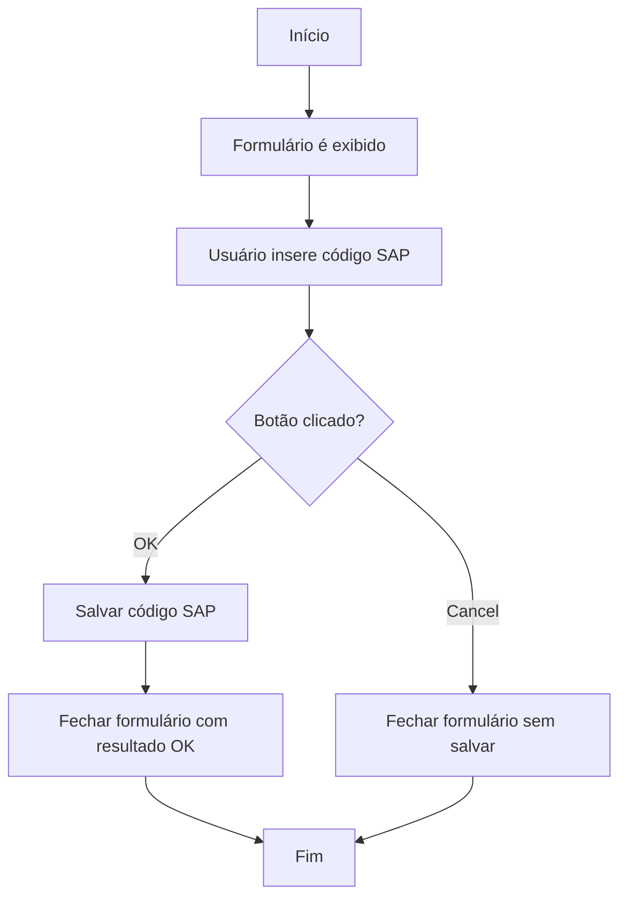
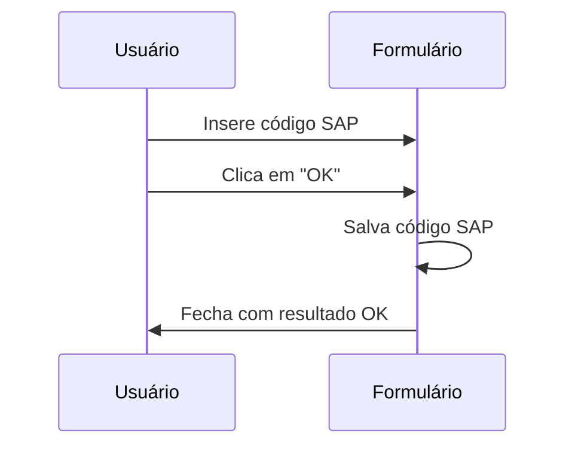

<!-- tabs:start -->

#### **Documentation**

## 1. Visão Geral:

* **Objetivo Principal e Problema Resolvido:**
  O objetivo principal deste código é criar uma interface de formulário para entrada de um código SAP. Ele permite que o usuário insira um código SAP válido e confirme ou cancele a operação. Este formulário é útil em sistemas onde é necessário capturar ou validar códigos SAP de forma simples e eficiente.

* **Tecnologias Utilizadas:**
  - Delphi (VCL - Visual Component Library).
  - Componentes de terceiros como `TsPanel`, `TsButton`, `TsLabel` (provavelmente da biblioteca AlphaControls) e `TcxMaskEdit` (da biblioteca DevExpress).

* **Tipo de Formulário:**
  - **Formulário:**
    - **Elementos do Formulário e seus Tipos:**
      - `LBLsapCode`: Rótulo (Label) para exibir o texto "SAP Code".
      - `EDTsapCode`: Campo de entrada (MaskEdit) para o código SAP.
      - `BTNok`: Botão para confirmar a entrada.
      - `BTNcancel`: Botão para cancelar a operação.
    - **Ações do Formulário e seus Efeitos:**
      - Botão "OK": Salva o valor do código SAP e fecha o formulário com o resultado `mrOk`.
      - Botão "Cancel": Fecha o formulário sem salvar o valor.

---

## 2. Descrição da Funcionalidade:

* **Ações Específicas:**
  - O usuário pode inserir um código SAP no campo de entrada.
  - O usuário pode confirmar a entrada clicando no botão "OK".
  - O usuário pode cancelar a operação clicando no botão "Cancel".

* **Componentes Principais:**
  - `EDTsapCode`: Permite a entrada de um código SAP, validado por uma máscara de expressão regular (`\d+`).
  - `BTNok`: Salva o código SAP e fecha o formulário.
  - `BTNcancel`: Fecha o formulário sem salvar.

* **Tradução para Pseudo-código:**
  - Evento `OnClick` do botão "OK": `se botão OK for clicado, então salvar o valor do campo EDTsapCode e fechar o formulário com resultado OK`.
  - Evento `OnClick` do botão "Cancel": `se botão Cancel for clicado, então fechar o formulário`.

---

## 3. Lógica Operacional:

* **Fluxo de Execução:**
  1. O formulário é inicializado e exibido ao usuário.
  2. O usuário insere um código SAP no campo de entrada.
  3. O usuário pode:
     - Confirmar a entrada clicando no botão "OK", o que salva o código e fecha o formulário.
     - Cancelar a operação clicando no botão "Cancel", o que fecha o formulário sem salvar.

* **Dados Necessários:**
  - O usuário deve fornecer um código SAP válido (apenas números).

---

## 4. Regras de Negócio:

* **Ações e Pré-condições:**
  - Botão "OK": Só deve ser clicado após o usuário inserir um código SAP válido.
  - Botão "Cancel": Pode ser clicado a qualquer momento para fechar o formulário.

* **Filtros Disponíveis:**
  - O campo `EDTsapCode` aceita apenas números devido à máscara de entrada configurada (`\d+`).

* **Mensagens de Erro:**
  - Não há mensagens de erro explícitas no código fornecido.

* **Valores Padrão dos Campos:**
  - O campo `EDTsapCode` não possui valor padrão definido no código.

* **Validação e Condições dos Campos:**
  - O campo `EDTsapCode`:
    - Aceita apenas números (validação por máscara de entrada).
    - Não possui limite de caracteres configurado explicitamente.

---

## 5. Funções Principais:

* **SetNewSapCode:**
  - Define o valor da propriedade `NewSapCode`.
  - **Lógica:** `FNewSapCode := Value`.

* **BTNokClick:**
  - Salva o valor do campo `EDTsapCode` na propriedade `NewSapCode` e fecha o formulário com o resultado `mrOk`.

* **BTNcancelClick:**
  - Fecha o formulário sem salvar o valor.

---

## 6. Consumo de Serviços de API:

* Este código não realiza chamadas a serviços externos.

---

## 7. Campos Condicionais (Lógica do Formulário):

* Não há campos condicionais no código fornecido.

---

## 8. Dependências:

* **Bibliotecas Externas:**
  - AlphaControls: Utilizada para os componentes `TsPanel`, `TsButton` e `TsLabel`.
  - DevExpress: Utilizada para o componente `TcxMaskEdit`.

* **Componentes Customizados:**
  - Não há componentes customizados além dos mencionados acima.

---

## 9. Listagem de Campos e Validações:

* **Campos:**
  - `EDTsapCode` (tipo: string, obrigatório, máscara: apenas números, sem limite de caracteres definido).

* **Mapeamento de Valores e Colunas do Banco de Dados:**
  - Não há mapeamento explícito para banco de dados no código fornecido.

---

## 10. Exemplos e Diagramas:

* **Fluxograma:**



* **Diagrama de Sequência:**



* **Código HTML Representando o Formulário:**

```html
<div style="width: 283px; height: 173px; background-color: #f0f0f0; font-family: 'MS Sans Serif';">
  <div style="padding: 10px;">
    <label for="sapCode" style="display: block; margin-bottom: 5px;">SAP Code:</label>
    <input id="sapCode" type="text" style="width: 100%; margin-bottom: 10px;" placeholder="Digite o código SAP">
    <div style="display: flex; justify-content: space-between;">
      <button style="width: 75px; height: 25px;">OK</button>
      <button style="width: 75px; height: 25px;">Cancel</button>
    </div>
  </div>
</div>
```

---

## 11. Comentários Importantes no Código:

* O evento `BTNokClick` é responsável por salvar o código SAP e fechar o formulário.
* O evento `BTNcancelClick` fecha o formulário sem salvar.

---

## 12. Conclusão:

O código implementa um formulário simples e funcional para entrada de códigos SAP. Ele é eficiente para capturar e validar entradas numéricas. No entanto, não possui mensagens de erro ou validações adicionais para entradas inválidas ou vazias.

---

## 13. Resumo Curto:

Formulário em Delphi para entrada de códigos SAP, com validação numérica e botões para confirmar ou cancelar a operação. Utiliza componentes AlphaControls e DevExpress para estilização e funcionalidade.#### **DsapCode.pas**

```
unit DsapCode;

interface

uses
  Windows, Messages, SysUtils, Variants, Classes, Graphics, Controls, Forms,
  Dialogs, StdCtrls, sButton, sEdit, sLabel, ExtCtrls, sPanel, cxControls,
  cxContainer, cxEdit, cxTextEdit, cxMaskEdit;

type
  TFORMDsapCode = class(TForm)
    PNL1: TsPanel;
    LBLsapCode: TsLabel;
    BTNok: TsButton;
    BTNcancel: TsButton;
    EDTsapCode: TcxMaskEdit;
    procedure BTNokClick(Sender: TObject);
    procedure BTNcancelClick(Sender: TObject);
  private
    { Private declarations }
    FNewSapCode: String;
    procedure SetNewSapCode(const Value: String);
  public
    { Public declarations }
    property NewSapCode: String read FNewSapCode write SetNewSapCode;

  end;

var
  FORMDsapCode: TFORMDsapCode;

implementation

{$R *.dfm}


{ TFORMDsapCode }

procedure TFORMDsapCode.SetNewSapCode(const Value: String);
begin
  FNewSapCode := Value;
end;

procedure TFORMDsapCode.BTNokClick(Sender: TObject);
begin

  FNewSapCode := EDTsapCode.Text;

  ModalResult := mrOk;
end;

procedure TFORMDsapCode.BTNcancelClick(Sender: TObject);
begin
  self.Close;
end;

end.
```

#### **DsapCode.dfm**

```
object FORMDsapCode: TFORMDsapCode
  Left = 824
  Top = 462
  Width = 283
  Height = 173
  Caption = 'New SAP Code'
  Color = clBtnFace
  Font.Charset = DEFAULT_CHARSET
  Font.Color = clWindowText
  Font.Height = -11
  Font.Name = 'MS Sans Serif'
  Font.Style = []
  OldCreateOrder = False
  PixelsPerInch = 96
  TextHeight = 13
  object PNL1: TsPanel
    Left = 0
    Top = 0
    Width = 267
    Height = 135
    Align = alClient
    TabOrder = 0
    SkinData.SkinSection = 'PANEL'
    object LBLsapCode: TsLabel
      Left = 24
      Top = 37
      Width = 52
      Height = 13
      Caption = 'SAP Code:'
    end
    object BTNok: TsButton
      Left = 40
      Top = 90
      Width = 75
      Height = 25
      Caption = 'OK'
      TabOrder = 0
      OnClick = BTNokClick
      SkinData.SkinSection = 'BUTTON'
    end
    object BTNcancel: TsButton
      Left = 144
      Top = 90
      Width = 75
      Height = 25
      Caption = 'Cancel'
      TabOrder = 1
      OnClick = BTNcancelClick
      SkinData.SkinSection = 'BUTTON'
    end
    object EDTsapCode: TcxMaskEdit
      Left = 99
      Top = 32
      Properties.MaskKind = emkRegExpr
      Properties.EditMask = '\d+'
      Properties.MaxLength = 0
      TabOrder = 2
      Width = 121
    end
  end
end
```
<!-- tabs:end -->

