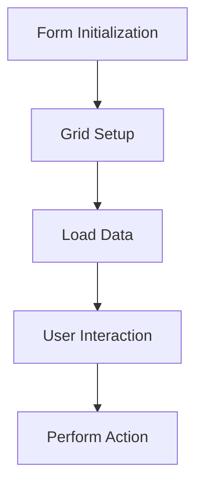
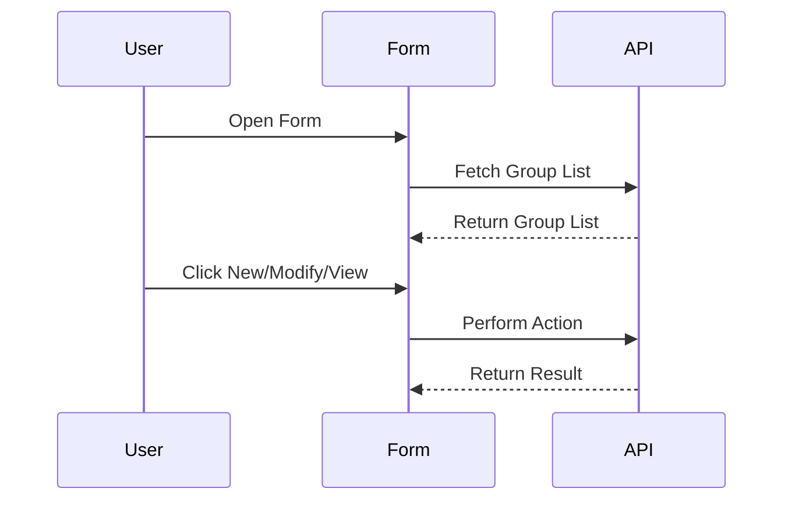

<!-- tabs:start -->

#### **Documentation**

# Documentation for `LcustomerGroup` Code Unit

## 1. Overview:

### Objective:
The `LcustomerGroup` code unit is designed to manage and display a list of customer groups in a grid format. It provides functionalities for searching, viewing, creating, and modifying customer group records. The main objective is to facilitate the management of customer groups through a user-friendly interface.

### Technologies Used:
- **Delphi**: The code is written in Delphi, utilizing its VCL (Visual Component Library) for UI components.
- **Third-party Libraries**: Includes components like `cxGrid`, `TsPanel`, `TsLabel`, and others for enhanced UI and functionality.
- **Database Integration**: Uses `DBClient` for database connectivity and data manipulation.

### Form Type:
This is a **grid display** form.

#### Grid Columns and Their Types:
1. **stat**: Status (Custom Editor: `cxEDTstatus`).
2. **groupCode**: Group Code (String).
3. **name**: Group Name (String).
4. **agent**: Agent (String).
5. **agentName**: Agent Name (String).
6. **lastUpd**: Last Updated (Date/Time).
7. **updBy**: Updated By (String).

#### Grid Actions and Their Effects:
1. **New**: Creates a new customer group.
2. **Modify**: Edits an existing customer group.
3. **View**: Displays details of a selected customer group.
4. **Search Area**: Filters the grid based on search criteria.
5. **Advanced Search**: Provides additional filtering options.

---

## 2. Functionality Description:

### User/Software Actions:
- **Create New Group**: Adds a new customer group to the database.
- **Modify Group**: Updates details of an existing customer group.
- **View Group**: Displays detailed information about a selected group.
- **Search**: Filters the grid based on user-defined criteria.

### Main Components:
1. **Grid (`cxDBGlist`)**: Displays the list of customer groups.
2. **Search Panel (`PNLsearchArea`)**: Contains search fields and buttons.
3. **Detail Panel (`PNLdetailArea`)**: Displays detailed information about a selected group.

### Pseudo-code for Actions and Events:
- **OnClick event of "New" button**: `if New button clicked then open new group form`.
- **OnClick event of "Modify" button**: `if Modify button clicked then open edit form for selected group`.
- **OnClick event of "View" button**: `if View button clicked then display details of selected group`.
- **OnChange event of search field**: `if search criteria changed then filter grid`.

---

## 3. Operational Logic:

### Execution Flow:
1. **Initialization**:
   - The form is created using `CreateListForm`.
   - The `Initialize` method sets up the service provider and loads data automatically.
2. **Grid Setup**:
   - Hidden fields and field order are defined in `GridSetup`.
   - Custom editors are added for specific fields.
3. **User Interaction**:
   - Users interact with the grid and buttons to perform actions like creating, modifying, or viewing groups.

### Required Data:
- **Group Code**: Unique identifier for the group.
- **Group Name**: Name of the group.
- **Status**: Current status of the group.

---

## 4. Business Rules:

### Actions and Preconditions:
- **New**: Enabled at all times.
- **Modify**: Enabled only when a group is selected.
- **View**: Enabled only when a group is selected.
- **Search**: Requires at least one search criterion.

### Available Filters:
- **Group Code**.
- **Group Name**.
- **Status**.

### Error Messages:
- "No group selected" if Modify or View is clicked without selecting a group.
- "Search criteria required" if Search is clicked without any criteria.

### Default Field Values:
- **Status**: Default is "Active".

### Field Validation and Conditions:
- **Group Code**: Required, must be unique.
- **Group Name**: Required, minimum 3 characters.
- **Status**: Must be one of the predefined statuses.

---

## 5. Main Functions:

1. **CreateListForm**:
   - Creates and initializes the form.
2. **Initialize**:
   - Sets up the service provider and loads data.
3. **GridSetup**:
   - Configures the grid, including hidden fields, field order, and custom editors.
4. **m_SetFindGroup**:
   - Configures the search functionality.

---

## 6. API Service Consumption:

### Service Name: `GroupListServiceUtils`
- **Endpoint**: `/api/groups`
- **Data Sent**: `{ "groupCode": "string", "name": "string", "status": "string" }`
- **Data Received**: `{ "status": "success", "data": "Group list" }`
- **Purpose**: Fetches the list of customer groups.
- **Error Handling**: Displays an error message if the API call fails.

---

## 7. Conditional Fields (Form Logic):

- **Search Criteria Panel**: Visible only when the user clicks on the "Search Area" button.
- **Detail Panel**: Visible only when a group is selected.

---

## 8. Dependencies:

### External Libraries:
- **cxGrid**: For grid display.
- **TsPanel, TsLabel**: For UI components.
- **DBClient**: For database connectivity.

### Custom Components:
- **FRAMEFindEditSOA**: Custom search frame for advanced filtering.

---

## 9. Fields and Validations Listing:

1. **Group Code**:
   - Type: String.
   - Required: Yes.
   - Validation: Must be unique.
2. **Group Name**:
   - Type: String.
   - Required: Yes.
   - Validation: Minimum 3 characters.
3. **Status**:
   - Type: String.
   - Required: Yes.
   - Validation: Must be one of the predefined statuses.

---

## 10. Examples and Diagrams:

### Flowchart:


### Sequence Diagram:


### Code Snippets:
```delphi
procedure TFORMLcustomerGroup.ACTnewExecute(Sender: TObject);
begin
  // Code to create a new group
end;
```

### Screenshots:
Not applicable (no DFM file provided).

---

## 11. Important Comments in the Code:

- **GridSetup**: Configures the grid, including hidden fields and custom editors.
- **Initialize**: Sets up the service provider and loads data automatically.

---

## 12. Conclusion:

The `LcustomerGroup` code unit provides a robust solution for managing customer groups. It integrates seamlessly with the database and offers a user-friendly interface. However, it could benefit from more detailed error handling and additional search filters.

---

## 13. Short Summary:

The `LcustomerGroup` unit manages customer groups through a grid interface, supporting actions like create, modify, view, and search. It integrates with a service API for data management and provides a customizable grid for efficient data display.#### **LcustomerGroup.pas**

```
unit LcustomerGroup;

interface

uses
  Windows, Messages, SysUtils, Variants, Classes, Graphics, Controls, Forms,
  Dialogs, kneCBListSOA, cxStyles, cxCustomData, cxGraphics, cxFilter,
  cxData, cxDataStorage, cxEdit, DB, cxDBData, knePrivileges, DBClient,
  cxEditRepositoryItems, ImgList, ActnList, sSkinProvider, ExtCtrls,
  sBevel, StdCtrls, sLabel, sScrollBox, cxGridLevel, cxClasses, cxControls,
  cxGridCustomView, cxGridCustomTableView, cxGridTableView,
  cxGridDBTableView, cxGrid, kneEnterAsTab, kneFRGridManager, Buttons,
  sSpeedButton, ToolWin, ComCtrls, acCoolBar, sBitBtn, sPanel, sSplitter,
  kneCBList, kneFRFindEditSOA, sDBText, sEdit;

type
  TFORMLcustomerGroup = class(TFORMkneCBListSOA)
    sLabel1: TsLabel;
    sBevel2: TsBevel;
    DBLstat: TsDBText;
    DBLlastUpd: TsDBText;
    DBLupdBy: TsDBText;
    LBL1: TsLabel;
    BVL2: TsBevel;
    EDTgroupCode: TsDBText;
    EDTname: TsDBText;
    Label10: TsLabel;
    FRAMEfindGroup: TFRAMEFindEditSOA;
    ACLeditingActions_deriv: TActionList;
    ACTnew_deriv: TAction;
    ACTmodify_deriv: TAction;
    ACTview_deriv: TAction;
    ACTsearchArea_deriv: TAction;
    ACTadvancedSearch_deriv: TAction;
    procedure ACTnewExecute(Sender: TObject);
  private
    procedure m_SetFindGroup;
    procedure m_AfterSearch(Sender: TObject);
    { Private declarations }
  protected
    procedure GridSetup; override;
    function SetupParams: Boolean; override;
    procedure EventSetup; override;
  public
    { Public declarations }
    class function CreateListForm(const AOwner: TComponent): TFORMkneCBList; virtual;
    class procedure Initialize(const pv_FormList: TFORMkneCBList); override;
    procedure CreateEditor; override;
  end;

var
  FORMLcustomerGroup: TFORMLcustomerGroup;

implementation

uses
  kneUtils,
  //---Forms
  McustomerGroup,
  //--ServiceUtils
  GroupListServiceUtils, GroupServiceUtils;

{$R *.dfm}

class function TFORMLcustomerGroup.CreateListForm(
  const AOwner: TComponent): TFORMkneCBList;
begin
  Result := TFORMLcustomerGroup.Create(AOwner);
  Initialize(Result);
end;


class procedure TFORMLcustomerGroup.Initialize(
  const pv_FormList: TFORMkneCBList);
begin
  inherited;
  TFORMkneCBListSOA(pv_FormList).ProviderService := TGroupListServiceUtils.Create(pv_FormList);
  TFORMkneCBListSOA(pv_FormList).AutoLoad        := True;
  TFORMkneCBListSOA(pv_FormList).ServiceParams.ShowInactives := True;
end;

procedure TFORMLcustomerGroup.GridSetup;
begin
  inherited;

  m_SetFindGroup;

  //Definir aqui os settings da dxGrid
  with GridSettings do
  begin
    // Campos Hidden ...........................................................
    DefineHiddenFields('HIDE_ALL_FIELDS');
    // Ordem Campos ............................................................
    DefineOrderFields('stat; groupCode; name; agent; agentName; lastUpd; updBy');
    // Custom Editors ..........................................................
    AddCustomField('stat','cxEDTstatus');
  end;

end;

```

#### **LcustomerGroup.dfm**

```
inherited FORMLcustomerGroup: TFORMLcustomerGroup
  Left = 536
  Top = 161
  Caption = 'Customer Group List'
  PixelsPerInch = 96
  TextHeight = 13
  inherited SPLlist: TsSplitter
    Top = 121
  end
  inherited PNLsearchArea: TsPanel
    Height = 77
    inherited PNLsearchButtons: TsPanel
      Height = 75
      TabOrder = 0
    end
    inherited SRBcriteria: TsScrollBox
      Height = 75
      TabOrder = 1
      inherited PNLcriteria: TsPanel
        Height = 71
        object Label10: TsLabel
          Left = 8
          Top = 16
          Width = 33
          Height = 13
          Caption = 'Group:'
          ParentFont = False
          Font.Charset = DEFAULT_CHARSET
          Font.Color = 5059883
          Font.Height = -11
          Font.Name = 'Tahoma'
          Font.Style = []
        end
        inline FRAMEfindGroup: TFRAMEFindEditSOA
          Left = 72
          Top = 11
          Width = 489
          Height = 21
          HorzScrollBar.Visible = False
          VertScrollBar.Visible = False
          Font.Charset = DEFAULT_CHARSET
          Font.Color = clWindowText
          Font.Height = -11
          Font.Name = 'Tahoma'
          Font.Style = []
          ParentBackground = False
          ParentFont = False
          TabOrder = 0
          inherited PNLdesc: TPanel
            Width = 383
            DesignSize = (
              383
              21)
            inherited DBEDesc: TsDBEdit
              Width = 383
            end
            inherited EDDesc: TsEdit
              Width = 383
            end
          end
        end
      end
    end
  end
  inherited PNLlist: TsPanel
    Top = 127
    Height = 424
    inherited SPT1: TsSplitter
      Height = 424
    end
    inherited PNLlistArea: TsPanel
      Height = 424
      inherited cxDBGlist: TcxGrid
        Height = 398
      end
    end
    inherited PNLdetailArea: TsPanel
      Height = 424
      inherited PNLviewer: TsScrollBox
        Height = 422
        object sLabel1: TsLabel
          Left = 8
          Top = 96
          Width = 43
          Height = 16
          Caption = 'Status'
          ParentFont = False
          Font.Charset = DEFAULT_CHARSET
          Font.Color = 5059883
          Font.Height = -13
          Font.Name = 'Tahoma'
          Font.Style = [fsBold]
        end
        object sBevel2: TsBevel
          Left = 7
          Top = 115
          Width = 209
          Height = 9
          Shape = bsTopLine
        end
```
<!-- tabs:end -->

